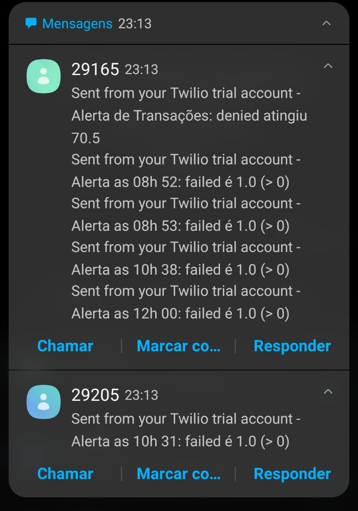

# Checkout Case

## Points:
- Both datasets have the same structure and represent a period of a day.
- Based on the data from both datasets, I could conclude that sales start to peak close to midday. The hours with the highest sales activity are between 10 AM - 6 PM.
- The metrics from both datasets follow the average. When comparing today's sales to the historical average, they are similar. This historical average gives a better perspective on the graph.
- A sudden drop in sales happens in the second dataset. Outliers can be seen between 3 PM - 5 PM, where sales just dropped to zero.

# Transaction Case

## Analysis:
- To begin, I analyzed the checkout datasets.
- Both datasets contain similar data, also representing a period of a day.
- They also contain categorical data. It may be interesting to convert these columns into numerical values for training ML models.
- The three most important transaction statuses for this case are: denied, reversed, and failed. When calculating the distribution of these statuses, both datasets are similar. When analyzing and comparing both datasets, the Upper Whisker (limit used to detect anomalies) is nearly identical. This indicator was used for anomaly detection and alerting.
- I also trained models using Linear Regression, but it did not perform well. The values were not as expected, and I was getting some negative results, so I decided to switch to score-based methods.

## To Run the Application:
- Clone the repository:
- Create the database, tables and insert the values with the files inside the folder `db`
    ```bash
    cd monitoring
    uvicorn endpoint:app --reload
    ```
- Go to the localhost in your browser.
- In your terminal, you will see transactions being collected from the database. **Note:** Adjust the sleep parameter to delay the data reading.
- Denied, reversed, and failed statuses that exceed the established threshold will trigger an SMS notification via Twilio. **Note:** Create a `.env` file and fill the variables as shown in `.env.example`.
  
Here is what the Twilio notification looks like to the team:  


# monitoring-challenge